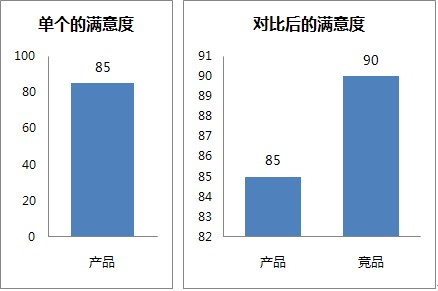
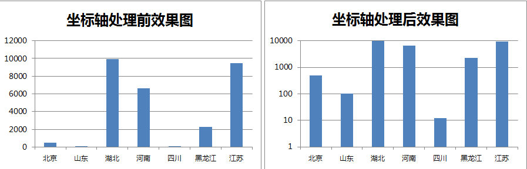
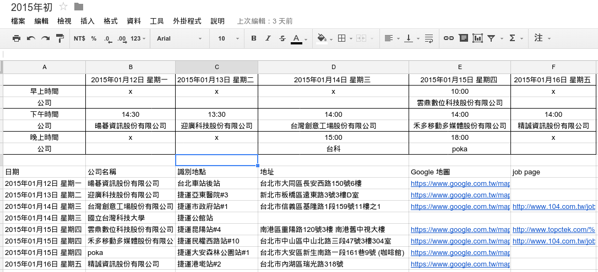
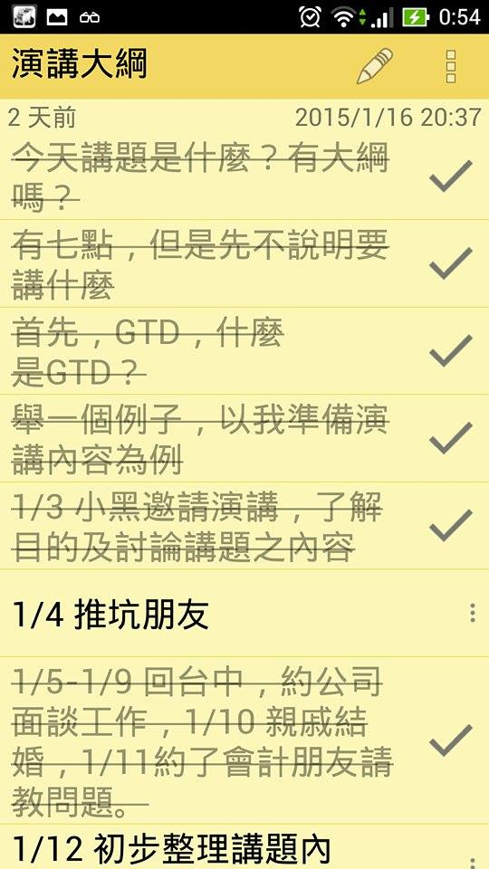
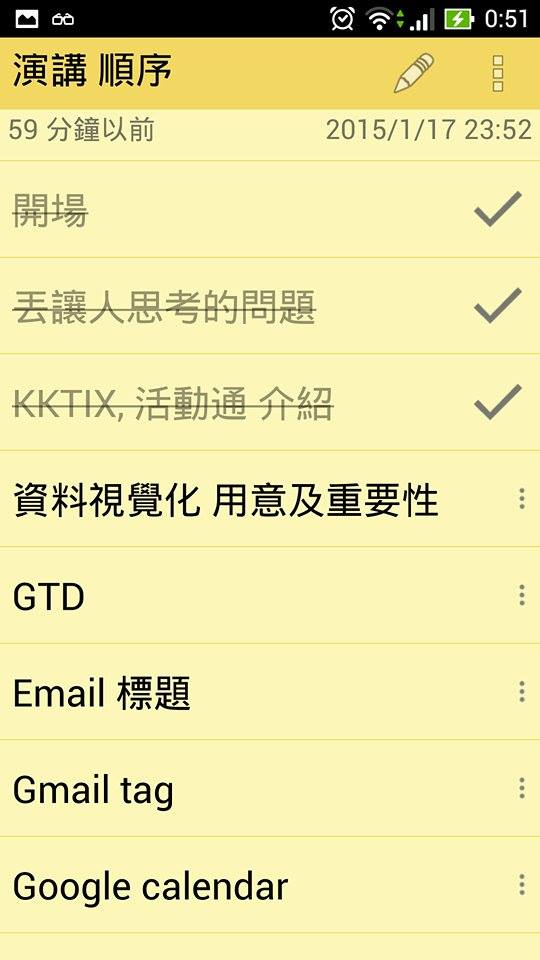
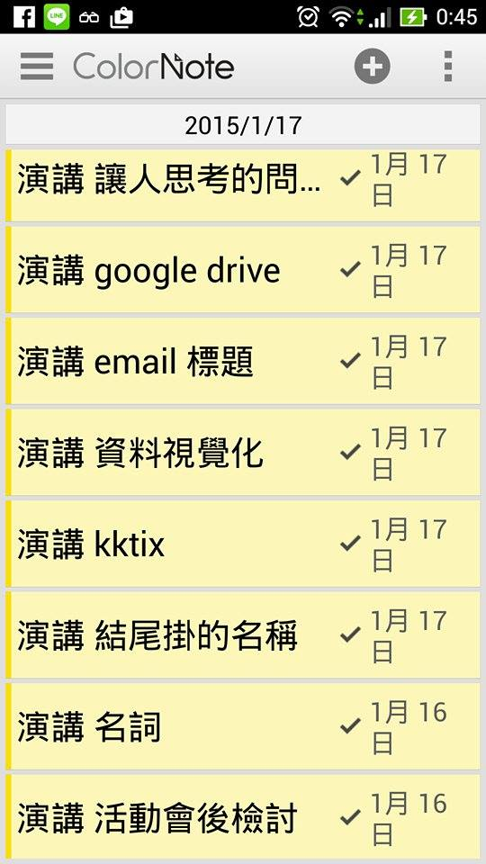
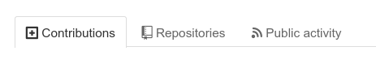

title: TMUP Organization With IT Slide - TMUP全方位企劃領導培訓營課程 社團經營的資訊應用
output: index.html

--

<h1 style="font-size: 72px">
Hackthon 
社團經營的資訊應用
</h1>
 

## Joe Angel
## 2015/01/18

--

### Who am I ?

 
<h2 style="font-size: 60px">
<b>Joe Angel</b>
</h2>

## <a href="https://fb.me/joeangel.tw" target="_blank">http://fb.me/joeangel.tw</a>
## <a href="http://joeangel.tw" target="_blank">http://JoeAngel.tw</a>

--

### Who am I ?

 
<h2 style="font-size: 60px">
<b>Joe Angel</b>
</h2>

* 學生計算機年會 SITCON 2013 第一屆公關長
* 開源人年會 COSCUP 2011, 2012 場務組
* 台灣駭客年會 HITCON 2012 場務組

--

### Hackthon?

 
<h2 style="font-size: 60px">
Hack + Marathon
</h2>

 

各領域的人員，相聚在一起，互相合作、共同設計、腦力激盪，去進行某項專案，並且創造出很棒的作品。

 

## Reference: <a href="https://www.openfoundry.org/tw/foss-news/9325-hackgen-2015" target="_blank">SITCON HACKGEN 2015 is Coming !</a>

--

### 社團經營的資訊應用?

 
<h2 style="font-size: 60px">
如何應用資訊科技
</h2>

--

### 這堂課將會讓你

 
<h2 style="font-size: 60px">
Think with IT.  Gain IT skills.
</h2>

--

### 這堂課也將會讓你

 
<h2 style="font-size: 60px">
提升  
從 Google 搜尋資料的能力！
</h2>

--

### 我希望這堂課能夠

 
<h2 style="font-size: 60px">
在歡樂氣氛中  學習、交流
</h2>

--

### 希望你在這堂課 :o

  
<h2 style="font-size: 45px">
換個方式思考，尤其是遇到困難時。  
也請將遇到的困難紀錄下來！
</h2>

--

### 希望你

  
<h2 style="font-size: 45px">
不要抄投影片上的字  
投影片會放在網路上
</h2>

--

### 還希望你

  
<h2 style="font-size: 45px">
不停地思考
</h2>

--

### 不停地思考

  
<h2 style="font-size: 45px">
嗡嗡嗡
</h2>

--

### 我深信

  
<h2 style="font-size: 45px">
互動、交流、分享  
有助於學習
</h2>

--

### 不需要客氣

  
<h2 style="font-size: 45px">
有任何問題，請馬上提問  
隨時都可以打斷我、發問
</h2>

--

### 從現在開始

  
<h2 style="font-size: 45px">
現在，有人要提問嗎？
</h2>

--

<h1 style="font-size: 72px">
  Thanks for listening!
   
</h1>

--

<h1 style="font-size: 72px">
  Thanks for listening!
   
</h1>

## 社團經營的資訊應用
## Joe Angel
## 2015/01/18

--

### Summary

 
<h2 style="font-size: 60px">
七大主題
</h2>

* 活動報名
* 資料視覺化
* GTD 行為管理
* 善用 Gmail
* 行事曆
* 谷歌雲端硬碟
* 活動後的檢討

--

### Summary

 
<h2 style="font-size: 60px">
七大主題
</h2>

* 活動報名
* 資料視覺化？
* GTD 行為管理
* 善用 Gmail
* 行事曆
* 谷歌雲端硬碟
* 活動後的檢討

--

### Summary

 
<h2 style="font-size: 60px">
選擇更好的方式呈現
</h2>
> 
1. 活動報名
2. 資料視覺化
3. GTD 行為管理
4. 善用 Gmail
5. 行事曆
6. 谷歌雲端硬碟
7. 活動後的檢討

--

### Summary

 
<h2 style="font-size: 60px">
七大主題
</h2>
> 
1. 活動報名 - KKTIX, 活動通
2. 資料視覺化 - 欺騙的藝術
3. GTD - Getting Things Done
4. 善用 Gmail
5. 行事曆 - Google Calendar, Sunrise Calendar
6. 谷歌雲端硬碟 - Google Form/Doc/Sheet
7. 活動後的檢討 - 吵架

--

### Summary

 
<h2 style="font-size: 60px">
七大主題
</h2>
> 
1. 活動報名 - KKTIX, 活動通
2. <del style="color:red">資料視覺化 - 欺騙的藝術</del>
3. GTD - Getting Things Done
4. 善用 Gmail
5. 行事曆 - Google Calendar, Sunrise Calendar
6. 谷歌雲端硬碟 - Google Form/Doc/Sheet
7. 活動後的檢討 - 吵架

--

### Summary

 
<h2 style="font-size: 60px">
七大主題
</h2>
> 
1. 活動報名 - 兩大網站
2. 資料視覺化 - 圖表的藝術
3. GTD - 把事情做好
4. 善用 Gmail
5. 行事曆
6. 谷歌雲端硬碟
7. 活動後的檢討

--

### Summary

 
<h2 style="font-size: 60px">
七大主題
</h2>
> 
1. v活動報名 - 兩大網站
2. 資料視覺化 - 圖表的藝術
3. GTD - 把事情做好
4. 善用 Gmail
5. 行事曆
6. 谷歌雲端硬碟
7. 活動後的檢討

--

### 1. 活動報名

 

* [KKTIX](https://kktix.com/)
> 讓活動報名變得更簡單
* [Accupass 活動通](https://kktix.com/)
> 讓生活因活動而生動 最好玩的找活動及辦活動平台

--

### 1. 活動報名

 

* [KKTIX](https://kktix.com/) - 目前最穩定的報名系統
> 讓活動報名變得更簡單
* [Accupass 活動通](https://kktix.com/) - 目前沒有參考數據
> 讓生活因活動而生動 最好玩的找活動及辦活動平台

## **使用差異：KKTIX 要建立組織名稱**

--

### Summary

 
<h2 style="font-size: 60px">
七大主題
</h2>
> 
1. 活動報名 - 兩大網站
2. v資料視覺化 - 圖表的藝術
3. GTD - 把事情做好
4. 善用 Gmail
5. 行事曆
6. 谷歌雲端硬碟
7. 活動後的檢討

--

### 2. 資料視覺化

  
<h2 style="font-size: 45px">
<del>詐欺</del>圖表的藝術
</h2>

--

### 2. 資料視覺化

 

產品/競品滿意度調查 
 

## <a href="http://cdc.tencent.com/?p=2746" target="_blank" style="font-size:18px">Reference: 統計數據背後的真相</a>

--

### 2. 資料視覺化

 

看到了什麼？ 
 

## <a href="http://cdc.tencent.com/?p=2746" target="_blank" style="font-size:18px">Reference: 統計數據背後的真相</a>

--

### 2. 資料視覺化

 

資料樣本數是否也會影響滿意度？ 
 

## <a href="http://cdc.tencent.com/?p=2746" target="_blank" style="font-size:18px">Reference: 統計數據背後的真相</a>

--

### 2. 資料視覺化

 

取值間隔 
 

## <a href="http://www.zhihu.com/question/19578400" target="_blank" style="font-size:18px">Reference: 「數據會說謊」的真實例子有哪些？</a>

--

### 2. 資料視覺化

 
<h2 style="font-size: 60px">
其他參考資料
</h2>

* <a href="http://www.techbang.com/posts/7875-statistics-on-how-deceptive-six-misread-a-chart-example" target="_blank" style="font-size:28px">統計數字有多會騙人？六張誤讀圖表的絕佳範例</a>

* <a href="https://books.google.com.tw/books?id=N3zcBAAAQBAJ&printsec=frontcover&hl=zh-TW#v=onepage&q&f=false" target="_blank" style="font-size:28px">Google 圖書: 統計如何說謊 - 自然書院 譯著</a>

--

### Summary

 
<h2 style="font-size: 60px">
七大主題
</h2>
> 
1. 活動報名 - 兩大網站
2. 資料視覺化 - 圖表的藝術
3. vGTD - 把事情做好
4. 善用 Gmail
5. 行事曆
6. 谷歌雲端硬碟
7. 活動後的檢討

--

### 3. GTD

  
<h2 style="font-size: 60px">
還沒找到合適的方法  
不慌不忙地完成事情？
</h2>

--

### 3. GTD

 

 

--

### 3. GTD

 

Getting Things Done 

* 一種行為管理的方法
* 也是 David Allen 寫的一本書之書名

## <a href="http://zh.wikipedia.org/zh-tw/GTD" target="_blank" style="font-size:18px">Reference: Wikipedia - GTD</a>

--

### 3. GTD

 

* 把所有事情都從你的腦袋裡弄出來。
* 在事情出現、而不是在事情爆發的時候， 就做好相關行動的一系列決定。

## <a href="http://zh.wikipedia.org/zh-tw/GTD" target="_blank" style="font-size:18px">Reference: Wikipedia - GTD</a>

--

### 3. GTD

 

* 心理上的好處： 易於保存、跟蹤、獲取需要完成的事情及相關的信息

## <a href="http://zh.wikipedia.org/zh-tw/GTD" target="_blank" style="font-size:18px">Reference: Wikipedia - GTD</a>

--

### 3. GTD

 

* 不把重點放在設置任務的優先順序
* 制定出在各種環境下的任務列表
    * 「行動列表」：制定一個需要打電話的列表
    * 「提醒列表」：制定一個半個月後旅遊需要攜帶的物品清單
* 任何兩分鐘之內就能完成的任務應該馬上做
* 至少每天或者只要你有時間就回顧檢查， 否則，「行動」和「提醒」列表將會變得毫無用處。

## <a href="http://zh.wikipedia.org/zh-tw/GTD" target="_blank" style="font-size:18px">Reference: Wikipedia - GTD</a>

--

### 3. GTD - 舉例

 

制定本週可被預約面試的時間表 
 

--

### 3. GTD - 舉例

 

制定一個演講大綱 
 

--

### 3. GTD - 舉例

 

<del>制定一個演講大綱</del> 
 

--

### 3. GTD - 舉例

 

<del>預謀挖坑&推坑朋友當講師</del> 
 

--

### 3. GTD - 舉例

 

制定一個演講大綱 
 

--

### 3. GTD - 舉例

 

根據演講大綱每個主題， 制定其內容 
 

--

### 3. GTD - 舉例

  
<h2 style="font-size: 60px">
都是在 
上週通勤面試的路上完成
</h2>

--

### 3. GTD

  
<h2 style="font-size: 45px">
通過記錄的方式， 
把頭腦中的各種任務移出來。<br/ ><br/ >
不再煩惱還有哪些代辦事項， 
集中精力在「正在完成」的事情。
</h2>

--

### 3. GTD

  
<h2 style="font-size: 60px">
還沒找到合適的方法  
不慌不忙地完成事情？
</h2>

--

### 3. GTD

  
<h2 style="font-size: 60px">
現在的你，也可以做到了！
</h2>

--

### Summary

 
<h2 style="font-size: 60px">
七大主題
</h2>
> 
1. 活動報名 - 兩大網站
2. 資料視覺化 - 圖表的藝術
3. GTD - 把事情做好
4. v善用 Gmail
5. 行事曆
6. 谷歌雲端硬碟
7. 活動後的檢討

--

### 4. 善用 Gmail

 

 

--

### 4. 善用 Gmail

  
<h2 style="font-size: 60px">
接下來的投影片會枯燥許多
</h2>

--

### 4. 善用 Gmail

  
<h2 style="font-size: 60px">
接下來的投影片會枯燥許多  
投影片上只會出現提示
</h2>

--

### 4. 善用 Gmail

  
<h2 style="font-size: 60px">
接下來的投影片會枯燥許多  
投影片上只會出現提示  
我們要開始分組實作了！
</h2>

--

### 4. 善用 Gmail

 
<h2 style="font-size: 60px">
本簡報位址
</h2>

## <a href="https://joeangel.tw" style="font-size:24px">http://JoeAngel.tw</a>  => 「Public」清單中   => 「GitHub」網址連結   =>「草尼貓 Logo」右方項目按鈕「Repositories」  => 「TMUP-Organization-With-IT-Slide」
##  

--

### 4. 善用 Gmail - 實作

 

1. 其中一人發 Email 給同組大家吧！注意 email 標題！
2. 請每一位組員回信，請使用「回覆給所有人」
3. 再發兩封信，標題意義分別如下 a. 企劃書 b. 第一次會議
4. 建立篩選器，篩選出「會議」信件、建立適合的標籤
5. 參考資料 a. <a href="http://skilltorich.com/1812/email-titlerule" target="_blank" style="font-size:18px">email 標題行銷原則</a> b. <a href="http://mag.chinatimes.com/mag-cnt.aspx?artid=15507" target="_blank" style="font-size:18px">職場 email 標題寫作要點</a> c. <a href="http://zh-tw.lmgtfy.com/?q=gmail+%E6%A8%99%E9%A1%8C+%E7%AF%A9%E9%81%B8" target="_blank" style="font-size:18px">Google 關鍵字：「gmail 標題 篩選」</a>

--

### Summary

 
<h2 style="font-size: 60px">
七大主題
</h2>
> 
1. 活動報名 - 兩大網站
2. 資料視覺化 - 圖表的藝術
3. GTD - 把事情做好
4. 善用 Gmail
5. v行事曆
6. 谷歌雲端硬碟
7. 活動後的檢討

--

### 5. 行事曆

 

* Sunrise
    * 跨平台，有 iOS app, Android app, Website
    * 能同時與各家 Calender 同步
    * 可以同步多個帳號
* Google Calendar

--

### 5. 行事曆 - 討論

 

1. 在 Google Calendar 新建一個日曆
2. 情境：現在要在 1/31 舉辦迎新介紹，時間二小時。  
    * 0.5H 致詞  、1H 介紹、0.5H 提問時間
    * 活動前要準備什麼？

--

### 5. 行事曆 - 實作

 

1. 在 Google Calendar 新建一個日曆
2. 情境：現在要在 1/31 舉辦迎新介紹，時間二小時。  
    * 0.5H 致詞  、1H 介紹、0.5H 提問時間
    * 活動前要準備什麼？
    * 嗡嗡嗡

--

### Summary

 
<h2 style="font-size: 60px">
七大主題
</h2>
> 
1. 活動報名 - 兩大網站
2. 資料視覺化 - 圖表的藝術
3. GTD - 把事情做好
4. 善用 Gmail
5. 行事曆
6. v谷歌雲端硬碟
7. 活動後的檢討

--

### 6. 谷歌雲端硬碟

 
<h2 style="font-size: 60px">
Google Drive
</h2>

1. Google 雲端硬碟 資料夾
2. Google 文件
3. Google 表單

--

### 6. 谷歌雲端硬碟 - 思考+動手玩

 
<h2 style="font-size: 60px">
這些功能可以做什麼？
</h2>

1. Google 雲端硬碟 資料夾
2. Google 文件
3. Google 表單

--

### 6. 谷歌雲端硬碟 - 實作

 

1. 建立一個資料夾
2. 將資料夾共用給組員們，權限設定為「編輯」
3. 建立 Google 文件

--

### 6. 谷歌雲端硬碟 - 實作 : 行事曆 - 情境題

 

1. 情境：現在要在 1/31 舉辦迎新介紹，時間二小時。  
    * 0.5H 致詞  、1H 介紹、0.5H 提問時間
    * 活動前要準備什麼？
    * 嗡嗡嗡
2. 在上一張投影片建立的 Google 文件，寫下活動前要準備的事項
3. 其中一人發 email 給組員，並附上第二點的 Google 文件作為附件

--

### Summary

 
<h2 style="font-size: 60px">
七大主題
</h2>
> 
1. 活動報名 - 兩大網站
2. 資料視覺化 - 圖表的藝術
3. GTD - 把事情做好
4. 善用 Gmail
5. 行事曆
6. 谷歌雲端硬碟
7. v活動後的檢討

--

### 7. 活動後的檢討

 
<h2 style="font-size: 60px">
Feeback
</h2>

1. 團隊內部檢討
2. 對活動的檢討
3. 會後意見調查表

## <a href="http://goo.gl/V3jzlh" target="_blank">Reference: SITCON 2014 會後意見調查表</a>

--

### Summary

 
<h2 style="font-size: 60px">
七大主題
</h2>
> 
1. 活動報名 - 兩大網站
2. 資料視覺化 - 圖表的藝術
3. GTD - 把事情做好
4. 善用 Gmail
5. 行事曆
6. 谷歌雲端硬碟
7. 活動後的檢討

--

<h1 style="font-size: 72px">
  Thanks for listening!
   
</h1>

<h2 style="font-size: 18px">
本投影片採用<a href="http://creativecommons.org/licenses/by-sa/3.0/tw/" target="_blank">創用 CC「姓名標示—相同方式分享 3.0 台灣」授權條款</a>
</h2>
